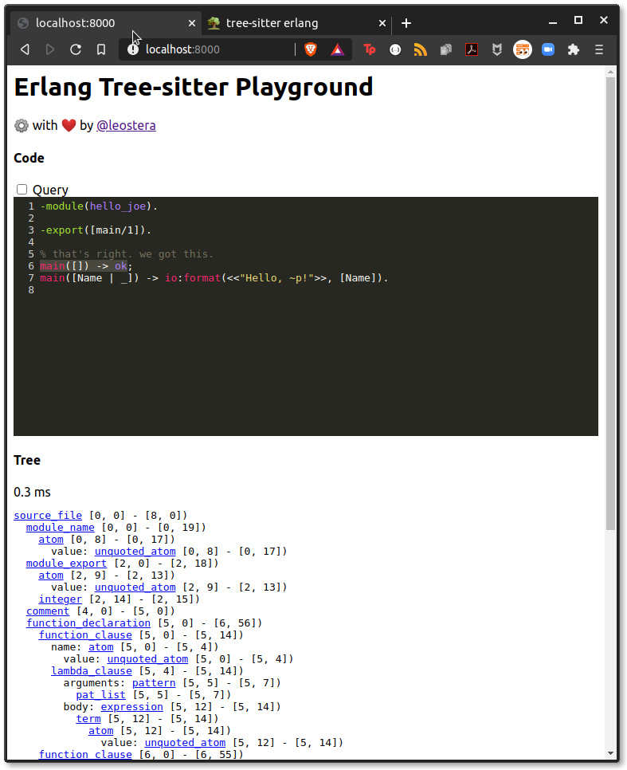

# tree-sitter grammar for Erlang

This repo has been **archived** since the Whatsapp fork is now in a lot better shape. Use that instead!

See: https://github.com/WhatsApp/tree-sitter-erlang/

---

Based on the [Standard Erlang grammar shipped with
OTP](https://github.com/erlang/otp/blob/master/lib/stdlib/src/erl_parse.yrl).

